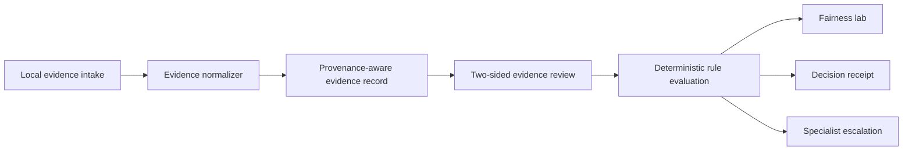

# ProofPair

ProofPair is a deterministic dispute-resolution workspace built for the American Express CodeStreet 2026 theme **Frictionless Dispute & Chargeback Resolution**.

It demonstrates how two-sided evidence can move through normalization, provenance, contradiction checks, versioned rule packs, a governed recommendation, metamorphic fairness tests, specialist escalation, and an explainable decision receipt.

## Product workflow

ProofPair is designed for one primary user: a dispute analyst.

1. Start in the dispute queue and prioritize by deadline or evidence state.
2. Open a case and understand the claim in plain language.
3. Compare card-member and merchant evidence side by side.
4. Review the recommended next step or route ambiguity to a specialist.

Rule checks, counterfactuals, behavioral assurance, and technical implementation details are available through progressive disclosure instead of competing with the primary review task.

## Prototype scope

- Five non-fraud reason-code packs: 4512, 4513, 4544, 4553, and 4554
- Six fictional cases with member-win, merchant-win, and specialist-escalation paths
- Local `.txt` / `.json` evidence ingestion
- Two-sided evidence review and explicit rule checks
- Counterfactual scenario simulator
- Four-test fairness lab, including role-swap symmetry
- Decision receipt and reviewable in-session event history
- Responsive queue, case review, assurance, and decision-receipt surfaces

All case data and operating metrics are synthetic. The prototype has no AMEX, payment-rail, merchant, carrier, or account connection.

## Run locally

```bash
npm install
npm run dev
```

Open `http://localhost:3000`.

## Verify

```bash
npm run ci
```

`npm run ci` runs linting, deterministic engine assertions, source-integrity checks, TypeScript validation, and a production build. `npm run preflight` begins from the committed lockfile and reproduces the clean-install CI path.

## Deploy

Production: [proofpair-prototype.vercel.app](https://proofpair-prototype.vercel.app/)

This is a standard Next.js application with a pinned Node major and a committed lockfile. Vercel is configured to install with `npm ci` and build with the same command used in CI.

See [docs/DEPLOYMENT.md](docs/DEPLOYMENT.md) for the release gate, first-time Vercel setup, and recovery steps.

## Architecture



The adjudication path is deterministic. A future OCR or language-model adapter may organize unstructured evidence, but it must not bypass the rule trace or execute account actions.

## Truth boundary

Implemented: client-side workflow, synthetic dataset, deterministic engine, local file normalization, four fairness transformations, scenario simulation, and printable receipt.

Not implemented: persistence, authentication, OCR, production policy coverage, calibrated confidence, external audit anchoring, or AMEX integrations.
