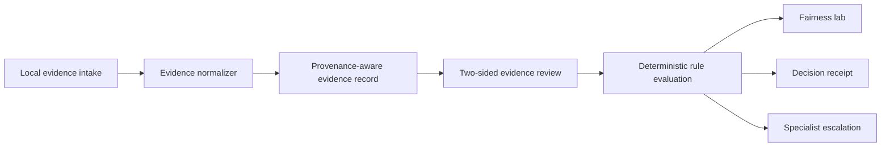

# ProofPair

ProofPair is a deterministic dispute-resolution workspace built for the American Express CodeStreet 2026 theme **Frictionless Dispute & Chargeback Resolution**.

It demonstrates how two-sided evidence can move through normalization, provenance, contradiction checks, versioned rule packs, a governed recommendation, metamorphic fairness tests, specialist escalation, and an explainable decision receipt.

## Product workflow

ProofPair is an end-to-end operating environment for a dispute analyst, operations lead, and governance reviewer:

1. The **command center** surfaces SLA exposure, workload, recent activity, and decision-path health.
2. The **dispute queue** supports saved views, search, bulk selection, ownership, evidence state, and routing.
3. The **case workspace** combines the narrative, transaction facts, party positions, tasks, and chronology.
4. The **evidence room** exposes requirement coverage, provenance, contradictions, and two-sided records.
5. The **decision studio** makes every configured signal and policy check inspectable, with counterfactual testing.
6. **Communications** supports controlled evidence requests while clearly remaining disconnected in the prototype.
7. The **audit trail** records case events, behavioral checks, and explicit truth boundaries.
8. **Portfolio intelligence** and **governance** expose synthetic workload patterns, rule packs, authority, and mocked integrations.

The interface uses progressive disclosure to preserve a clear operating path without deleting expert controls.

## Prototype scope

- Five non-fraud reason-code packs: 4512, 4513, 4544, 4553, and 4554
- Six fictional cases with member-win, merchant-win, and specialist-escalation paths
- Local `.txt` / `.json` evidence ingestion
- Two-sided evidence review and explicit rule checks
- Counterfactual scenario simulator
- Four-test fairness lab, including role-swap symmetry
- Decision receipt and reviewable in-session event history
- Responsive command center, queue, five-tab case workspace, portfolio, governance, and printable receipt

All case data and operating metrics are synthetic. The prototype has no AMEX, payment-rail, merchant, carrier, or account connection.

## Run locally

```bash
npm install
npm run dev
```

Open `http://localhost:3000`.

## Verify

```bash
npm run ci
```

`npm run ci` runs linting, deterministic engine assertions, source-integrity checks, TypeScript validation, and a production build. `npm run preflight` begins from the committed lockfile and reproduces the clean-install CI path.

## Deploy

Production: [proofpair-prototype.vercel.app](https://proofpair-prototype.vercel.app/)

This is a standard Next.js application with a pinned Node major and a committed lockfile. Vercel is configured to install with `npm ci` and build with the same command used in CI.

See [docs/DEPLOYMENT.md](docs/DEPLOYMENT.md) for the release gate, first-time Vercel setup, and recovery steps.

## Architecture



The adjudication path is deterministic. A future OCR or language-model adapter may organize unstructured evidence, but it must not bypass the rule trace or execute account actions.

## Truth boundary

Implemented: client-side workflow, synthetic dataset, deterministic engine, local file normalization, four fairness transformations, scenario simulation, and printable receipt.

Not implemented: persistence, authentication, OCR, production policy coverage, calibrated confidence, external audit anchoring, or AMEX integrations.
