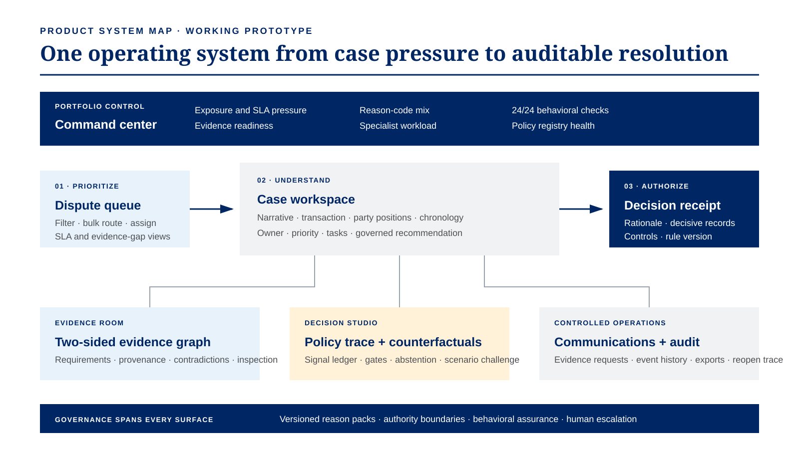

# ProofPair

ProofPair is a deterministic dispute-resolution workspace built for the American Express CodeStreet 2026 theme **Frictionless Dispute & Chargeback Resolution**.

It demonstrates how two-sided evidence can move through normalization, provenance, contradiction checks, versioned rule packs, behavioral assurance checks, specialist escalation, and an explainable decision receipt.

## Product workflow

ProofPair is an end-to-end operating environment for a dispute analyst, operations lead, and governance reviewer:

1. The **command center** surfaces SLA exposure, workload, recent activity, and decision-path health.
2. The **dispute queue** supports saved views, search, bulk selection, ownership, evidence state, and routing.
3. The **case workspace** combines the narrative, transaction facts, party positions, tasks, and chronology.
4. The **evidence room** exposes requirement coverage, provenance, contradictions, and two-sided records.
5. The **decision studio** makes every configured signal and policy check inspectable, with counterfactual testing.
6. **Communications** supports controlled evidence requests and an in-session outbound queue.
7. The **audit trail** records case events, behavioral checks, and explicit truth boundaries.
8. **Portfolio intelligence** and **governance** expose synthetic workload patterns, rule packs, authority, and mocked integrations.

The interface uses progressive disclosure to preserve a clear operating path without deleting expert controls. Operational changes are visible immediately, reversible where appropriate, and carried across the queue and case workspace for the current session.

## Prototype scope

- Five non-fraud reason-code packs: 4512, 4513, 4544, 4553, and 4554
- Six fictional cases with member-win, merchant-win, and specialist-escalation paths
- Local `.txt` / `.json` evidence ingestion
- Two-sided evidence review and explicit rule checks
- Counterfactual scenario simulator
- Four-property behavioral assurance lab, including two-party monotonicity and role-swap symmetry
- Decision receipt and reviewable in-session event history
- Operational notifications with direct case routing
- Configurable queue columns, select-all, bulk assignment, priority, and specialist routing
- Editable case narratives, ownership, priority, and review checklist
- Inspectable evidence records with local reviewed state and metadata export
- Controlled message drafting, audience filters, deadline editing, and a local outbound queue
- Queue, portfolio, audit, and policy-registry exports
- Responsive command center, queue, five-tab case workspace, portfolio, governance, and printable receipt

All case data and operating metrics are synthetic. The prototype has no AMEX, payment-rail, merchant, carrier, or account connection.

## Run locally

```bash
npm install
npm run dev
```

Open `http://localhost:3000`.

## Verify

```bash
npm run ci
```

`npm run ci` runs linting, 15 deterministic/source assertions, TypeScript validation, and a production build. Separately, the prototype exposes 24/24 passing behavioral transformations across six synthetic cases. `npm run preflight` begins from the committed lockfile and reproduces the clean-install CI path.

## Deploy

Production: [proofpair-amex.vercel.app](https://proofpair-amex.vercel.app/)

This is a standard Next.js application with a pinned Node major and a committed lockfile. Vercel is configured to install with `npm ci` and build with the same command used in CI.

See [docs/DEPLOYMENT.md](docs/DEPLOYMENT.md) for the release gate, first-time Vercel setup, and recovery steps.

## Architecture



The visual pack also contains [structural wireframes](docs/visuals/proofpair-wireframes.svg), the [end-to-end resolution flow](docs/visuals/dispute-resolution-flow.svg), the [four-gate decision path](docs/visuals/decision-control-flow.svg), and an explicitly labelled [production event-flow target](docs/visuals/production-event-flow.svg).

The adjudication path is deterministic. A future OCR or language-model adapter may organize unstructured evidence, but it must not bypass the rule trace or execute account actions.

## Truth boundary

Implemented: client-side workflow state, synthetic dataset, deterministic engine, verified-evidence completeness, governed signal weights, resolved/unresolved contradiction gates, local file normalization, queue operations, evidence inspection, controlled message queue, four behavioral transformations, scenario simulation, exports, and printable receipt.

Not implemented: persistence beyond the active browser session, authentication, OCR, production policy coverage, calibrated confidence, external audit anchoring, outbound communications, or AMEX integrations.

## Submission pack

- [Paste-ready project description](docs/submission/project-description.md)
- [Technical truth pack](docs/submission/technical-truth-pack.md)
- [Architecture, stack and scale plan](docs/submission/architecture-and-scale.md)
- [80-second silent demo storyboard](docs/submission/demo-storyboard.md)
- [Screenshot captions](docs/submission/screenshot-captions.md)
- [Final consistency gate](docs/submission/final-consistency-checklist.md)
- [Verification report](docs/submission/verification-report.md)
- [Release manifest](docs/submission/release-manifest.md)
- [Primary source list](docs/submission/sources.md)
