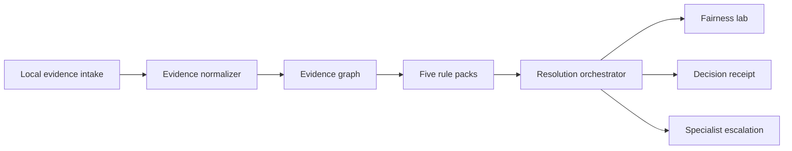

# ProofPair

ProofPair is a deterministic dispute-resolution workspace built for the American Express CodeStreet 2026 theme **Frictionless Dispute & Chargeback Resolution**.

It demonstrates how two-sided evidence can move through normalization, provenance, contradiction checks, versioned rule packs, a governed recommendation, metamorphic fairness tests, specialist escalation, and an explainable decision receipt.

## Prototype scope

- Five non-fraud reason-code packs: 4512, 4513, 4544, 4553, and 4554
- Six fictional cases with member-win, merchant-win, and specialist-escalation paths
- Analyst, Card Member, and Merchant persona lenses
- Local `.txt` / `.json` evidence ingestion
- Evidence graph and explicit rule trace
- Counterfactual scenario simulator
- Four-test fairness lab, including role-swap symmetry
- Decision receipt and reviewable in-session event history
- Responsive command center, queue, workbench, fairness, and controls surfaces

All case data and operating metrics are synthetic. The prototype has no AMEX, payment-rail, merchant, carrier, or account connection.

## Run locally

```bash
npm install
npm run dev
```

Open `http://localhost:3000`.

## Verify

```bash
npm run lint
npm test
```

`npm test` runs deterministic engine assertions, a production build, and a server-render smoke test.

## Architecture



The adjudication path is deterministic. A future OCR or language-model adapter may organize unstructured evidence, but it must not bypass the rule trace or execute account actions.

## Truth boundary

Implemented: client-side workflow, synthetic dataset, deterministic engine, local file normalization, four fairness transformations, scenario simulation, and printable receipt.

Not implemented: persistence, authentication, OCR, production policy coverage, calibrated confidence, external audit anchoring, or AMEX integrations.
